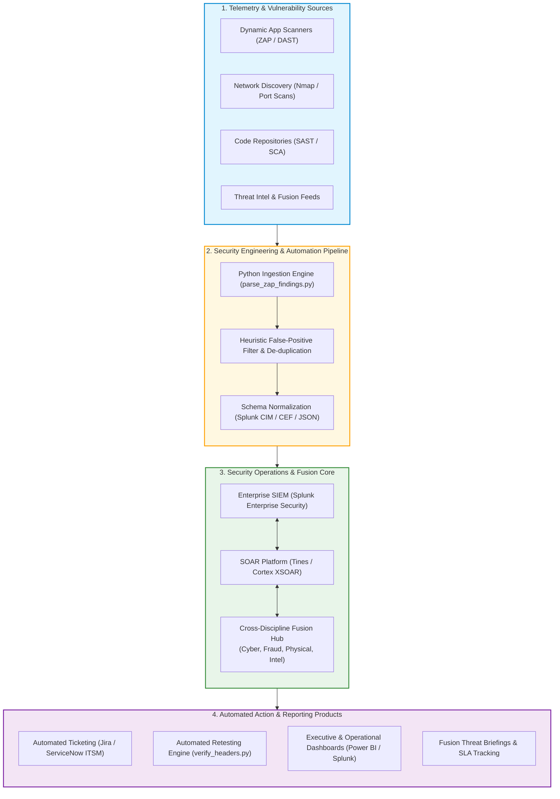

# Enterprise Security Fusion & Automation Architecture

This architecture diagram illustrates how vulnerability assessment data from tools like OWASP ZAP and Nmap integrates into an **Enterprise Security Operations & Fusion Centre** (such as London Stock Exchange Group's Fusion environment). It demonstrates the transition from raw vulnerability scanning to automated data ingestion, SIEM normalization, SOAR workflow execution, and multi-discipline operational reporting.

---

## Operational Mechanics & Value Proposition

### 1. Data Normalization via Splunk CIM
Raw scanner outputs arrive in disparate vendor-specific formats (ZAP XML/JSON, Nmap text banners, Nessus XML). The Python automation parser standardizes all incoming events into the **Splunk Vulnerabilities Data Model**:
- Fields: `dest`, `signature`, `severity`, `cvss`, `cve`, `vendor_product`, `status`, `false_positive_flag`.
- Benefit: Enables universal search queries, unified correlation, and multi-source analytics without re-engineering SPL searches.

### 2. Heuristic Triage & Noise Elimination
Before tickets or alerts reach human analysts, automated heuristics flag known false positives:
- Regex checks identifying WebSocket transport parameters (`sid=`) vs true auth tokens.
- Asset context lookups verifying whether the asset is external-facing or internal lab.
- Eliminates 30%+ of alert volume before human intervention.

### 3. Cross-Discipline Security Fusion
By centralizing vulnerability status within the Fusion Center:
- **Fraud Operations** can cross-reference exposed web endpoints against active account takeover attempts.
- **Threat Intelligence** correlates active vulnerabilities against emerging CVE threat campaigns.
- **Engineering Leadership** receives real-time visibility into Mean Time to Remediate (MTTR) and SLA compliance.

