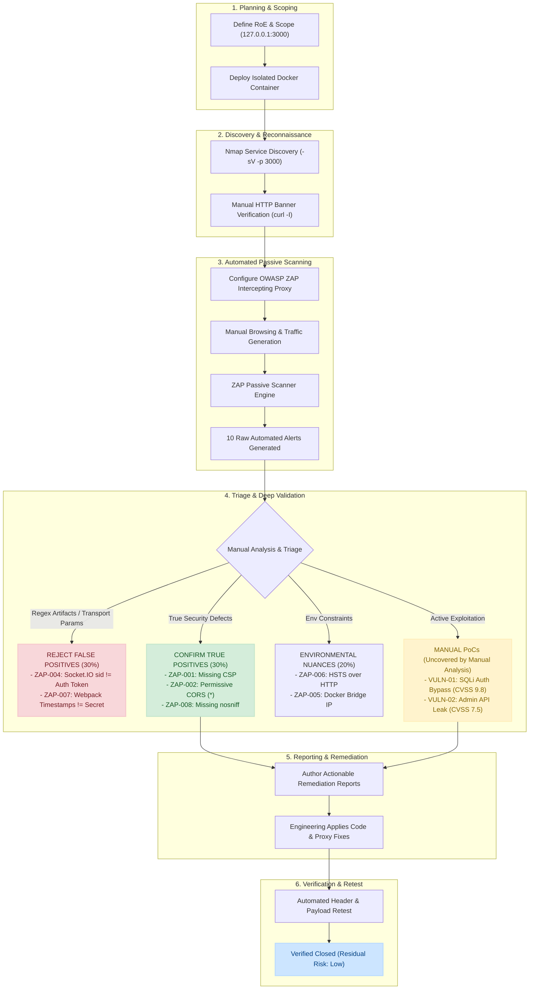

# Assessment Methodology Workflow

This diagram illustrates the end-to-end lifecycle of the authorized VAPT assessment, tracking the flow from initial scoping and container setup to automated scanning, manual triage, false positive elimination, and retesting verification.

